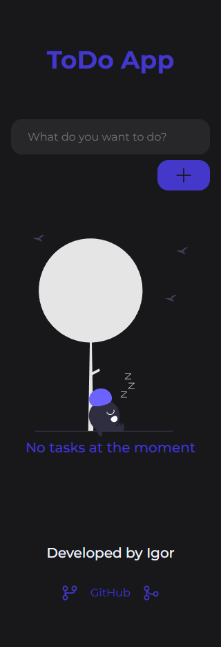
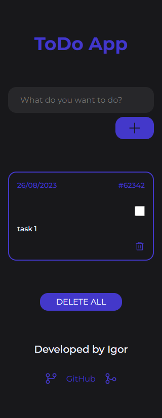
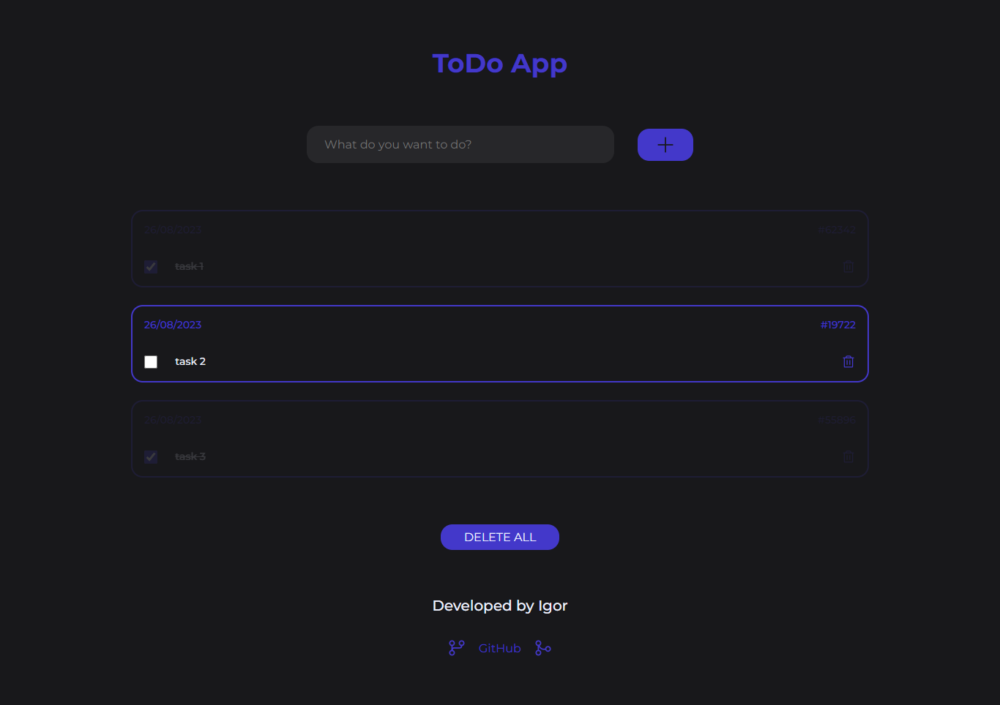

# ToDo App

ToDo App is a straightforward web application that enables users to create and manage tasks. With a user-friendly interface and useful features, users can add, edit, and delete tasks, as well as mark tasks as completed. It's a practical tool for organizing daily activities and keeping track of responsibilities.

## Images

## TECHNOLOGIES

-   React.js
-   TypeScript
-   Sass
-   Redux
-   Redux Toolkit
-   React Hook Form
-   Yup

## User-Focused Features

-   Responsive Design: Have a seamless experience across different devices with a responsive layout that adapts to various screen sizes.
-   Task Creation and Management, including Editing, Marking as Done, or Deleting as Desired

## Developer-Centric Resources

-   Custom imports
-   Global state management with Redux
-   Form Creation, Validation, and Control with React Hook Form and Yup
-   Code formatting with Eslint and Prettier
-   BEM architecture for styling
-   Global variables for project styling

## Deploy

-   [Access ToDo App](https://todo-app-ig.vercel.app/)

## How to Use

-   Clone this repository to your computer
-   Install dependencies using the command: `pnpm i`
-   Start the development server with: `pnpm dev`
-   Open your browser and navigate to: `http://localhost:3000`
