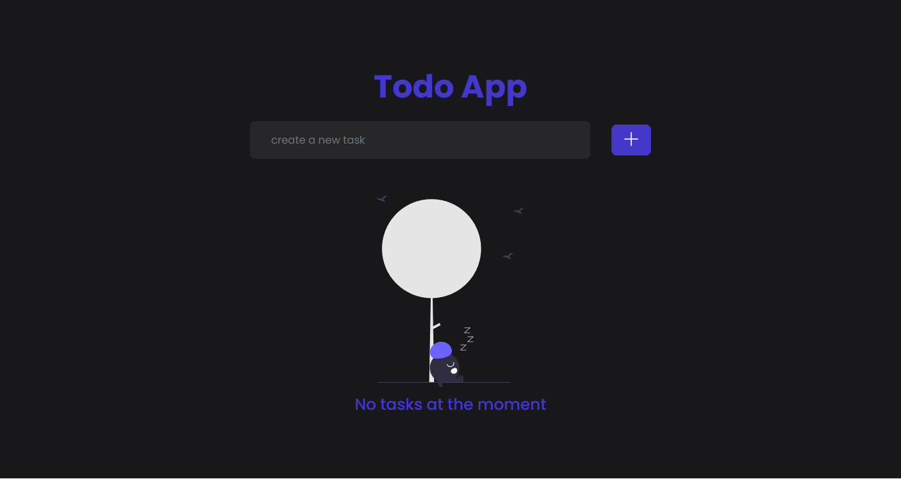

## NAME

```
DESCRIPTION

<div align="center">
    
</div>
```

## OBJECTIVE

```
- ITEM
```

## FEATURES

```
- ITEM
```

## TECHNOLOGIES

```
- React.js
- TypeScript
- SASS
- Redux
```

## Usage

```
- Installation: within the project root, type "yarn" in the terminal
- Initialization: within the project root, type "yarn dev" in the terminal
```
